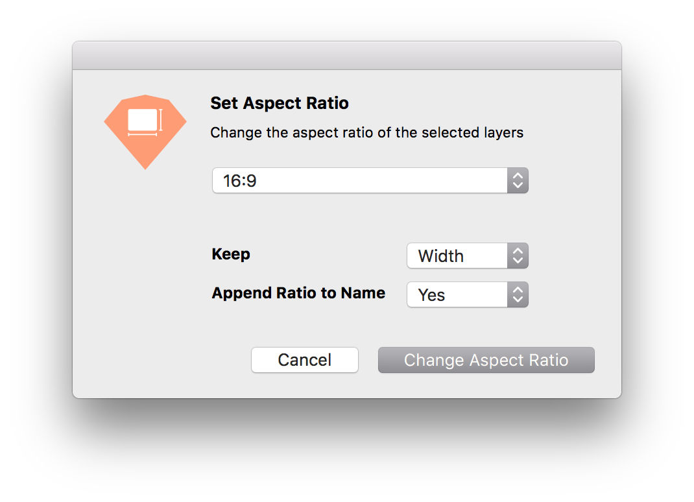

<hr />

This plugin for [Sketch](https://www.sketchapp.com) helps you change the size of a layer to fit to a desired aspect ratio. Aspect ratios can be selected from a list of presets or entered manually.



If you find any bugs or have suggestions for the further development please open a new [issue](https://github.com/preciousforever/sketch-aspect-ratio/issues)!

## How to install

Download the latest version from the [releases page](https://github.com/preciousforever/sketch-aspect-ratio/releases), unzip it and open the file to install it in Sketch.

## How to change the preset aspect ratios

The list of presets is located in [/src/resources/ratios.js](/src/resources/ratios.js). If you want to customize you can change it to your liking and then build a new version of the plugin by running `gulp build`. A new version of the plugin is then created in `/dist`. You can install this version to have your own list of presets available in Sketch.

## Development

This plugin is based on Sketch Fusion by [Andrey Shakhmin, @turbobabr](https://github.com/turbobabr), as presented at [#SketcHHackday 2016](http://designtoolshackday.com).

Development

```
npm install
gulp watch
```

To release a new version as github release, run:

```
export GITHUB_TOKEN=yoursecrettoken
gulp release
```
